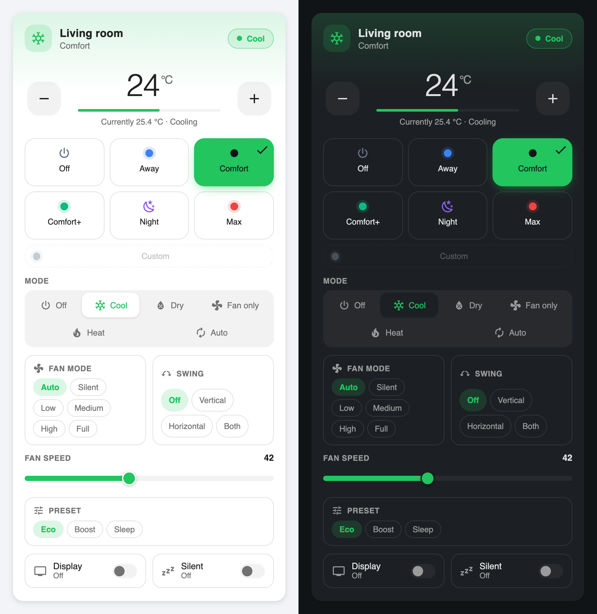
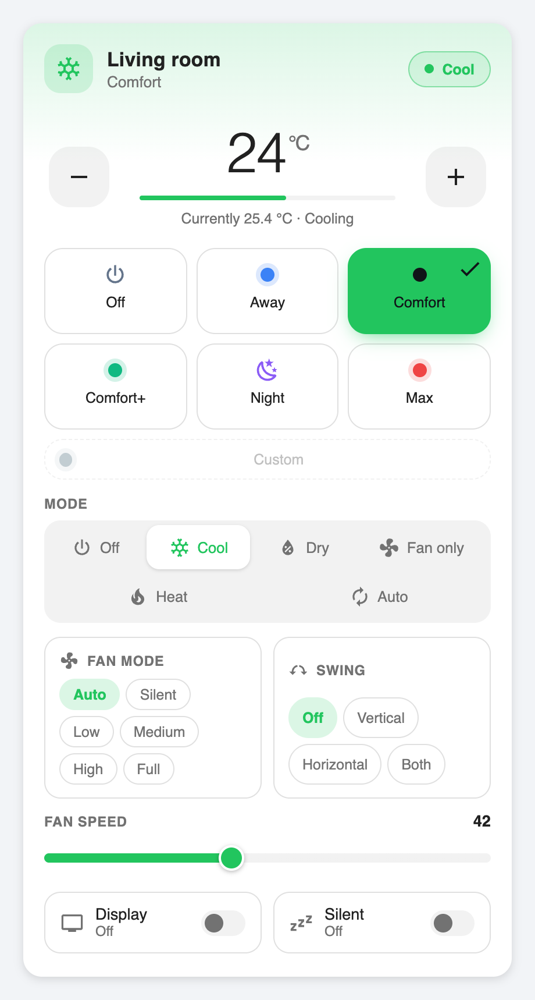
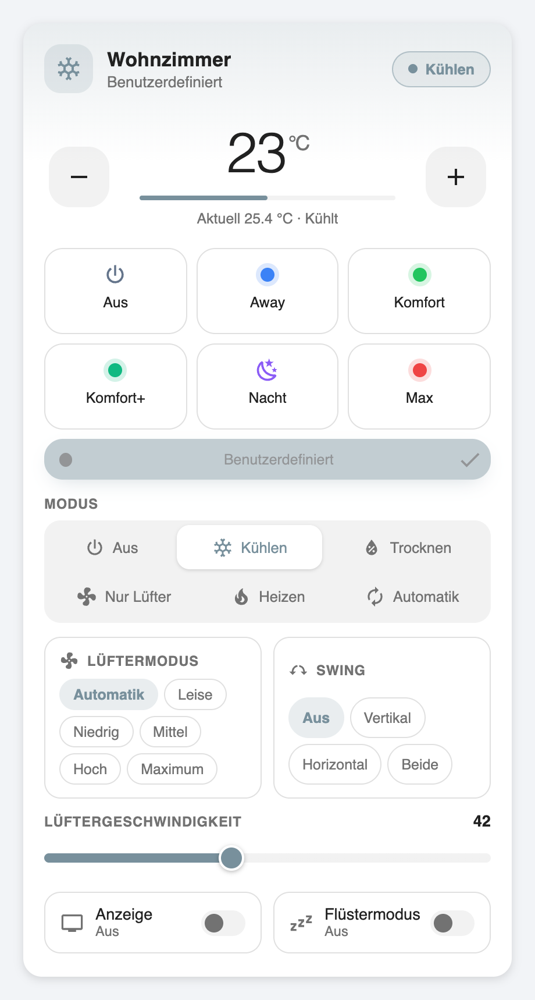
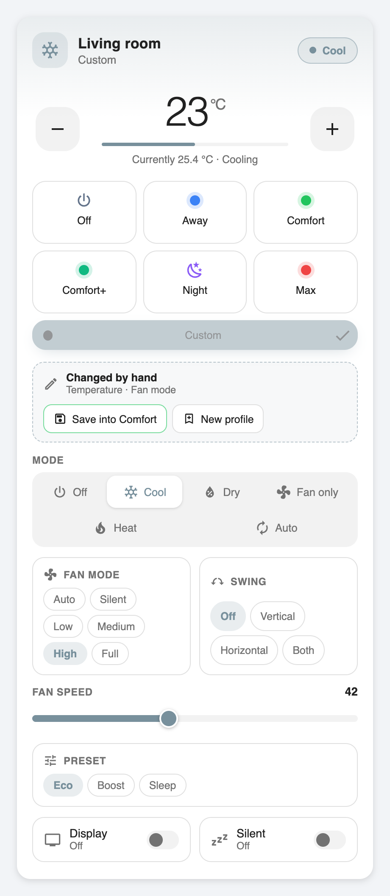
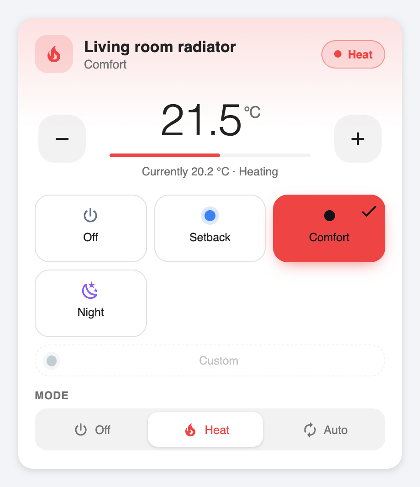

# Climate Profiles

A Home Assistant integration that turns any `climate` entity - an air
conditioner, a heat pump, a radiator thermostat - plus the optional
`number`/`switch` entities some devices expose, into freely configurable
profiles, and tells you which profile is currently active.

It replaces the usual "template sensor plus a script full of `choose` blocks"
package with a proper integration: profiles are configured in the UI, the
matching happens server side, and a custom Lovelace card renders it.



## What it does

* pick a climate entity, optionally a fan speed `number`, a display `switch`
  and a silent mode `switch` - anything you leave out is simply not offered
* create as many profiles as you like, with your own names, colours and icons
* a profile only defines the values it cares about; applying it leaves
  everything else exactly where it is
* the integration continuously reports which profile matches the current state
  - and **Benutzerdefiniert** ("custom") as soon as you change anything by hand
* custom is a status, never a preset: it has no stored values and never writes
  anything back
* adjusted something by hand? Write it back into the profile it came from, or
  save the state as a new profile - with a click, never behind your back
* profiles can be write protected, so the ones you rely on cannot be
  overwritten by accident
* modes, temperature range, step widths and fan limits are read from the
  devices, never hard coded - a thermostat simply shows fewer controls
* several devices, each with its own profiles and its own Home Assistant device

## Installation

### HACS (recommended)

[](https://my.home-assistant.io/redirect/hacs_repository/?owner=julezdean&repository=ha-climate-profiles&category=integration)

The button opens this repository in your own HACS, adding it as a custom
repository if it is not known there yet. Download it and restart Home
Assistant. By hand it is the same thing:

1. HACS → Integrations → ⋮ → *Custom repositories*
2. add this repository, category *Integration*
3. install **Climate Profiles**
4. restart Home Assistant

### Manual

1. copy `custom_components/climate_profiles` into your `config/custom_components`
2. restart Home Assistant

The Lovelace card is registered automatically. You do not have to add a
resource by hand.

## Setup

**Settings → Devices & services → Add integration → Climate Profiles**

1. **Climate device** - a name and the `climate` entity.
2. **Optional entities** - fan speed (`number`), display (`switch`), silent
   mode (`switch`). Leave empty what your device does not have.
3. **Profiles** - a starter set is offered, built from what your device
   actually supports. Modes it does not advertise are left out, temperatures
   are clamped into its range.

Each config entry creates one device with two entities:

| Entity | Purpose |
| --- | --- |
| `sensor.<name>_klimaprofil` | the active profile's name, plus everything the card needs as attributes |
| `select.<name>_profil` | pick a profile - works in automations, scripts and voice assistants |

## Managing profiles

**Settings → Devices & services → Climate Profiles → Configure**

| Menu entry | What it does |
| --- | --- |
| Optional entities | add or remove fan/display/silent later; clearing a field stops that function being used |
| Add profile | name, colour, icon and the values it should set |
| Edit profile | change everything; **clear a field to remove that value from the profile** |
| Change order | the order profiles are matched and shown in |
| Delete profiles | remove one or several |
| Rename "custom" | the name shown when nothing matches |

Each profile form has a **write protection** checkbox. It only blocks the
quick "capture" path - this form always stays editable.

Only `hvac_mode` is required - a profile that does not say what the device
should do is rarely useful. Everything else is optional and, when left empty,
is not touched when the profile is applied.

### Why "change order" is not drag & drop

Home Assistant renders config flows as plain forms; there is no sortable list
widget available to a custom integration. The closest native equivalent is
what this integration does: pick the profiles one after another in the order
you want. Anything you leave out keeps its relative position at the end.

The order matters: **the first profile that matches the current state wins.**
So put specific profiles above broad ones.

## The card

```yaml
type: custom:climate-profile-card
entity: sensor.wohnzimmer_klimaprofil
```

Everything else - profiles, colours, which controls exist, the temperature
range - comes from the integration. Options, all optional:

| Option | Default | Meaning |
| --- | --- | --- |
| `name` | the entity's name | title shown in the header |
| `profile_layout` | `auto` | `auto`, `grid` or `scroll` |
| `show_temperature` | `true` | big temperature readout with −/+ |
| `show_hvac` | `true` | mode selector |
| `show_fan_mode` | `true` | fan mode chips |
| `show_swing` | `true` | swing mode chips |
| `show_fan` | `true` | fan speed slider |
| `show_display` | `true` | display toggle |
| `show_silent` | `true` | silent mode toggle |

A control that the device does not offer is hidden regardless of the setting.
More examples: [`examples/lovelace.yaml`](examples/lovelace.yaml).

| Profile active | Nothing matches |
| --- | --- |
|  |  |

The card only renders and calls services. It never decides which profile is
active - that answer always comes from the integration, so the developer
tools, your automations and the card can never disagree.

## Taking manual changes into a profile

Adjust anything while a profile is active and the card offers to keep it:



* **Save into <profile>** updates the profile you were in. Values it already
  defines are updated; a value you changed by hand is added to it.
* **New profile** stores the state as a new profile - useful when the
  deviation is worth keeping without bending an existing profile.
* Doing nothing is a third option: the state simply stays custom.

The offer also appears while a *partial* profile is still active. A profile
that says nothing about the fan keeps matching when you change the fan - and
that is exactly a change worth offering to capture.

Nothing is ever captured automatically. That is deliberate: a profile that
rewrites itself silently is the most unpleasant kind of surprise, and it would
mean the profile could never report "custom" again.

**Write protection** is set per profile in the options. A protected profile
refuses to be captured into - the card then only offers the "new profile"
route. It can still be edited deliberately in the options; protection guards
the quick path, not the deliberate one.

**After a restart** nothing is assumed. The reference point for "what did you
change" only exists while Home Assistant runs, so a fresh start with a
deviating state stays custom and offers no target until a profile matches
again. Name the profile explicitly in the service call if you need it anyway.

### Not only air conditioners

Nothing in the integration assumes cooling. A radiator thermostat with no fan
and no swing modes gets the same profiles, with everything it cannot do left
out - of the card as well:



The starter profiles are cooling shaped, so a heating only device gets just
the "Aus" profile offered and you add your own. Modes the device does not
advertise are never sent.

### Known limitations

| Not covered | What happens |
| --- | --- |
| `preset_mode` (eco/comfort/boost on many thermostats) | not a profile value; profiles set the temperature instead of the device's own preset |
| `target_temp_low`/`target_temp_high` (devices in `heat_cool`) | only `temperature` is read and written, so a profile with a temperature never matches such a device - the state stays custom rather than claiming a match |
| `humidity` | not a profile value |

Both gaps are pinned down by tests in `tests/test_heating.py`.

## Services

### `climate_profiles.apply_profile`

```yaml
action: climate_profiles.apply_profile
target:
  entity_id: sensor.wohnzimmer_klimaprofil
data:
  profile: Komfort        # name or id
```

Writes only the values the profile defines. Values that already match produce
no service call at all - except when the hvac mode changes, because many
devices reset their attributes on a mode change.

An unknown profile raises a clean `ServiceValidationError` naming the profiles
that do exist; it never destabilises Home Assistant.

### `climate_profiles.set_value`

```yaml
action: climate_profiles.set_value
target:
  entity_id: sensor.wohnzimmer_klimaprofil
data:
  temperature: 23
  silent: true
```

Writes individual values and re-evaluates which profile that state
corresponds to. All fields are optional, at least one is required.

### `climate_profiles.capture_profile`

```yaml
action: climate_profiles.capture_profile
target:
  entity_id: sensor.wohnzimmer_klimaprofil
data:
  profile: Komfort        # optional - defaults to the profile that last matched
  values: [temperature]   # optional - defaults to deciding automatically
```

### `climate_profiles.save_as_profile`

```yaml
action: climate_profiles.save_as_profile
target:
  entity_id: sensor.wohnzimmer_klimaprofil
data:
  name: Mittagshitze
  color: "#f59e0b"        # optional
  icon: mdi:weather-sunny # optional
  values: [temperature]   # optional - defaults to the whole state
```

More: [`examples/automations.yaml`](examples/automations.yaml).

## Sensor attributes

```yaml
active_profile: Komfort
active_profile_id: 2b3c4d5e…      # stable, use this in automations
active_profile_color: "#22c55e"
profiles: [{id, name, color, icon, order, protected, values}, …]
custom_profile: {id: __custom__, name: Benutzerdefiniert, color: "#78909c"}
current_values: {hvac_mode: cool, temperature: 24.0, …}
capabilities: {hvac_modes: […], min_temp: 16, target_temp_step: 1, …}
entities: {climate: …, fan: …, display: …, silent: …}
applying: false
last_matched_profile_id: 2b3c4d5e…   # what "capture" would write into
changed_values: [temperature]        # what it would change; empty after a restart
```

Automations should trigger on `active_profile_id`. The state is the display
name and changes when you rename a profile; the id does not.

## How matching works

A profile matches when **every value it defines** equals the current state.
Values it does not define are ignored:

```text
Profile:  hvac_mode = cool, temperature = 24
Current:  hvac_mode = cool, temperature = 24, fan_mode = high, swing = both
          -> matches
```

Comparison is tolerant where devices are sloppy: case insensitive for modes,
half the device's step width as tolerance for temperatures, and `on`/`off`/
`true`/`false` all mean the same thing. A value that cannot be read (an
unavailable entity) never counts as a match.

If no profile matches, the state is the custom profile. It has no values, so
it can never be "applied" - selecting it does nothing on purpose.

## Development

```bash
pip install pytest-homeassistant-custom-component ruff
pytest                 # unit tests + tests against a real Home Assistant
ruff check . && ruff format --check .
python tools/make_screenshots.py     # see docs/screenshots.md
```

The matching logic (`models.py`, `matching.py`) has no Home Assistant imports
at all, which keeps it testable on its own and keeps the rules in one place.

The brand images in `custom_components/climate_profiles/brand/` are rendered
from [assets/climate_profiles_icon.svg](assets/climate_profiles_icon.svg) with
`rsvg-convert` (`brew install librsvg`):

```bash
rsvg-convert -w 256 -h 256 assets/climate_profiles_icon.svg \
  -o custom_components/climate_profiles/brand/icon.png
rsvg-convert -w 512 -h 512 assets/climate_profiles_icon.svg \
  -o custom_components/climate_profiles/brand/icon@2x.png
```

One icon serves both themes on purpose, so there are no `dark_*` variants, and
there is no separate logo either: Home Assistant falls back to the icon
wherever a logo would go. The bundled images are picked up from Home Assistant
2026.3 onwards; older versions show a placeholder on the integrations page.

## Accessibility

Every control is a real button with an `aria-label` and `aria-pressed`, the
focus ring is visible, and the active profile is marked with a check mark and
not by colour alone. The card measures both candidate text colours against
each profile colour and picks the more readable one. Very saturated mid tone
colours (a strong violet, for example) can still stay slightly below the 4.5:1
AA ratio - the profile name is always shown in the header as plain text as
well.

## Licence

MIT. The vendored Material Design Icons paths in `tools/mdi-paths.js` are
Apache-2.0.
