# Climate Profiles

A Home Assistant integration that turns any `climate` entity - an air
conditioner, a heat pump, a radiator thermostat - plus any entity beside it
whose state is a single value, into freely configurable profiles, and tells
you which profile is currently active.

It replaces the usual "template sensor plus a script full of `choose` blocks"
package with a proper integration: profiles are configured in the UI, the
matching happens server side, and a custom Lovelace card renders it.

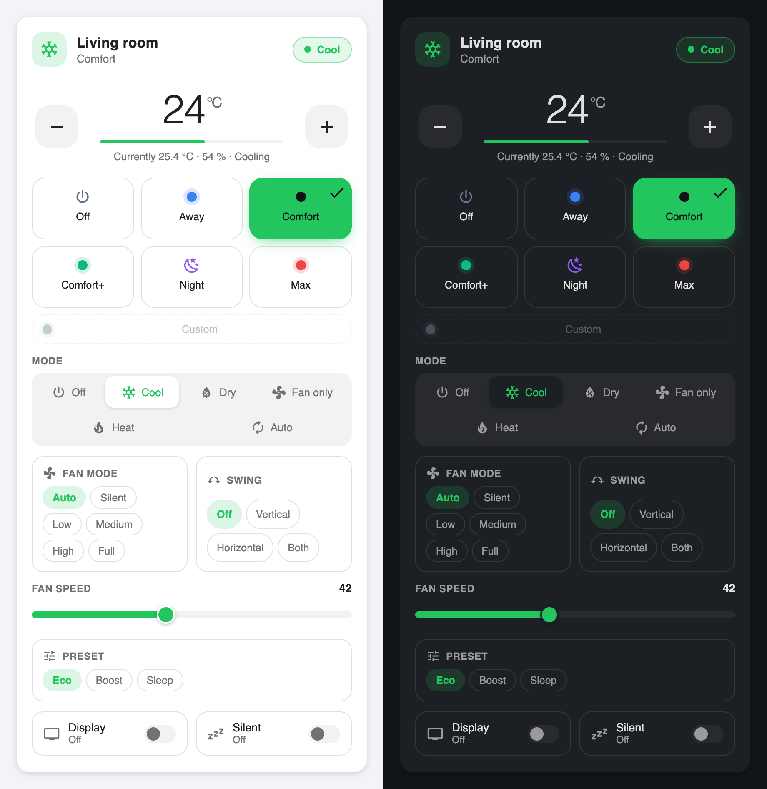

## What it does

* pick a climate entity, then add as many **additional values** as your device
  has: a fan speed `number`, a display `switch`, a preset `select` - anything
  whose state is a single value
* create as many profiles as you like, with your own names, colours and icons
* a profile only defines the values it cares about; applying it leaves
  everything else exactly where it is
* the integration continuously reports which profile matches the current state
  - and **Custom** as soon as you change anything by hand
* custom is a status, never a preset: it has no stored values and never writes
  anything back
* adjusted something by hand? Write it back into the profile it came from, or
  save the state as a new profile - with a click, never behind your back
* profiles can be write protected, so the ones you rely on cannot be
  overwritten by accident
* modes, temperature range, step widths and fan limits are read from the
  devices, never hard coded - a thermostat simply shows fewer controls
* the temperature is a bar or a dial, whichever suits the dashboard, with what
  the device reports about the room - its temperature, its humidity, what it is
  doing right now - beside it
* several devices, each with its own profiles and its own Home Assistant device

## Installation

### HACS (recommended)

[](https://my.home-assistant.io/redirect/hacs_repository/?owner=julezdean&repository=ha-climate-profiles&category=integration)

The button opens this repository in your own HACS, adding it as a custom
repository if it is not known there yet. Download it and restart Home
Assistant. By hand it is the same thing:

1. HACS → Integrations → ⋮ → *Custom repositories*
2. add this repository, category *Integration*
3. install **Climate Profiles**
4. restart Home Assistant

### Manual

1. download `climate_profiles.zip` from the [latest
   release](https://github.com/julezdean/ha-climate-profiles/releases/latest)
   and unpack it into `config/custom_components/climate_profiles/`, or copy the
   `custom_components/climate_profiles` folder out of the repository
2. restart Home Assistant

The Lovelace card is registered automatically, as a resource under
**Settings → Dashboards → Resources** - you do not have to add it by hand. Only
a dashboard whose resources are declared in YAML owns that list itself; there
the log says which URL to add.

What changed in each version is in the [changelog](CHANGELOG.md).

## Setup

**Settings → Devices & services → Add integration → Climate Profiles**

One form: a name and the `climate` entity. No profiles are invented for you -
a starter set shaped like an air conditioner is of little use on a radiator
thermostat, and everybody ends up rewriting it anyway. Add yours under
**Configure → Manage profiles**, and give the ones you rely on write
protection.

Everything your device has beyond the climate entity is added afterwards, under
**Configure → Manage values**: add a row, pick the entity, done. If your
climate entity sits on a Home Assistant device, the same form offers its
siblings to tick off instead - a fan speed, a display switch and a silent mode
switch in three ticks rather than three searches. Supported are `number`,
`input_number`, `switch`, `input_boolean`, `select` and `input_select` - the
domains whose state is a single value, which is what a profile can compare and
write.

Each config entry creates one device with two entities:

| Entity | Purpose |
| --- | --- |
| `sensor.<name>_climate_profile` | the active profile's name, plus everything the card needs as attributes |
| `select.<name>_profile` | pick a profile - works in automations, scripts and voice assistants |

(The entity names are translated, so a German instance gets
`sensor.<name>_klimaprofil` and `select.<name>_profil`.)

## Managing profiles

**Settings → Devices & services → Climate Profiles → Configure**

Two lists, and everything about an entry happens in one of them.

| List | One row is | The row holds |
| --- | --- | --- |
| **Manage values** | an additional value | name, the entity behind it, an icon |
| **Manage profiles** | a profile | name, colour, icon, how it becomes active, whether the card offers it, what a change by hand does, and every value it sets |

A row is dragged to move it, the pencil opens it, the bin removes it, and the
button below the list adds one. The id a profile or a value is known by rides
along in its row without being shown: it is what everything stored points at,
and nothing you would ever want to type. The order of the rows is the order profiles are
matched and shown in, and the order values appear on the card.

Two things that are not rows:

* **Add values from this device** sits under the value list: everything on the
  same device that could carry a value, minus what you already have, as a list
  to tick off. They land at the end of the list.
* **The order values are written in** sits there too, over the climate values
  and yours mixed - a silent mode that sets its own fan speed wins or loses by
  its place. `hvac_mode` always goes first.

Under the profile list are the three fields of **"custom"** - name, colour and
icon. It has no values; it is what the card shows when nothing matches.

Clearing a value in a row removes it from that profile: an empty field means
the profile does not touch that value. Deleting a value from the value list
leaves what profiles stored for it alone - it is simply skipped from then on.
To point a value at a different entity, edit its row; adding it anew creates a
new value with a new id, and every profile loses it.

Each profile's row says what a **change by hand** should do while that profile
is active, and the three answers are the whole story:

| | |
| --- | --- |
| Ask before storing | the card offers to capture it - the default |
| Store automatically | it is written straight into the profile, without an offer |
| Write protected | nothing is ever stored over the quick path |

The row itself always stays editable, whatever is chosen there.

Only `hvac_mode` is required - a profile that does not say what the device
should do is rarely useful. Everything else is optional and, when left empty,
is not touched when the profile is applied.

### What the order decides

Several profiles can match at once. **The most specific one wins** - the one
defining the most values - and the order of the rows decides between profiles
that are equally specific. The card shows them in that order too.

## The card

```yaml
type: custom:climate-profile-card
entity: sensor.living_room_climate_profile
```

Everything else - profiles, colours, which controls exist, the temperature
range - comes from the integration. Options, all optional:

| Option | Default | Meaning |
| --- | --- | --- |
| `name` | the entity's name | title shown in the header |
| `profile_layout` | `auto` | `auto`, `grid`, `scroll`, `dropdown` or `icons` |
| `temperature_style` | `bar` | `bar` or `dial` |
| `hide` | `[]` | values to leave out, by key or id |

Everything configured is shown unless you hide it, so a value you add later
appears without editing every dashboard. The list mixes the four climate keys
with the ids of your additional values, the same way a profile's values do:

```yaml
hide: [swing_mode, 7f3a9c1e…]
```

The visual editor shows a switch per value and writes this list for you. It
offers only the values your device actually has - a radiator thermostat has no
fan mode to hide.
More examples: [`examples/lovelace.yaml`](examples/lovelace.yaml).

`temperature_style: dial` draws the temperature as a ring, with the two step
buttons in the gap at its bottom and what the room reports in its middle - a
drag around an arc rarely lands on the half degree you meant.

`profile_layout: dropdown` puts the profiles into one list instead of a wall of
buttons, for a dashboard where this is one card among many. The field shows the
active profile with its icon, or a dot in its colour where it has none, and the
open list shows the same for every profile - a native `<select>` can draw
neither, which is why this one is built from buttons and takes the arrow keys,
Enter and Escape. **Custom** appears in the list only while it is what the
device is doing, and cannot be picked: it has no values to apply. The open list
pushes the rest of the card down instead of floating over it - a list that
floats is cut off wherever something clips the card, and plenty of themes do.

`profile_layout: icons` is the shortest form: one row, one button per profile,
nothing but its icon - or a dot in its colour where it has none. The name is
the button's label, so a pointer and a screen reader still get it; the active
profile is the filled button, without the check mark the other layouts draw -
it would sit on top of the icon. **Custom** joins the row only while it is
what is on.

`auto` chooses neither - it is grid up to six profiles and scroll beyond.

### Hidden from the card

A profile can be **hidden on the card** - a "Summer" that only an automation
sets, and nobody should pick by hand. It is one switch in the profile's row,
off by default, and it holds for every dashboard at once.

Hidden means not offered, not invisible: while the hidden profile is what the
device is doing, the card shows it like any active profile - it just cannot be
picked there. The rest of the time it is not in the list, in any layout, and it
does not count towards the six profiles `auto` decides by.

It is about the card and nothing else. `apply_profile` and the select entity
still reach it - the select has to keep it among its options, or its state
would read "unknown" exactly while the hidden profile is active. And it is not
write protection: change something by hand while it is active, and the card
offers to store that into it like into any other profile, unless its row says
**Write protected**.

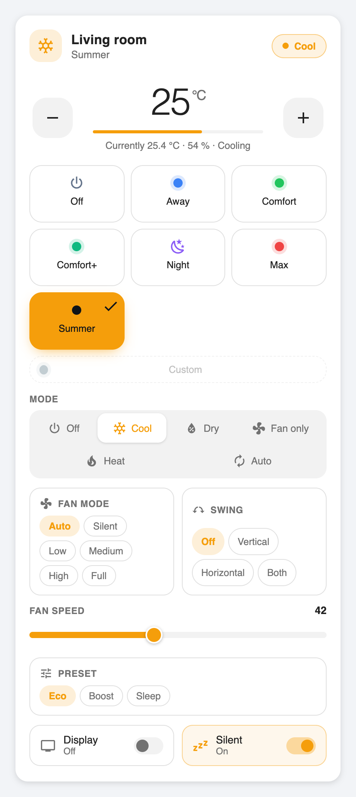

| Profile active | Nothing matches | `temperature_style: dial` |
| --- | --- | --- |
| 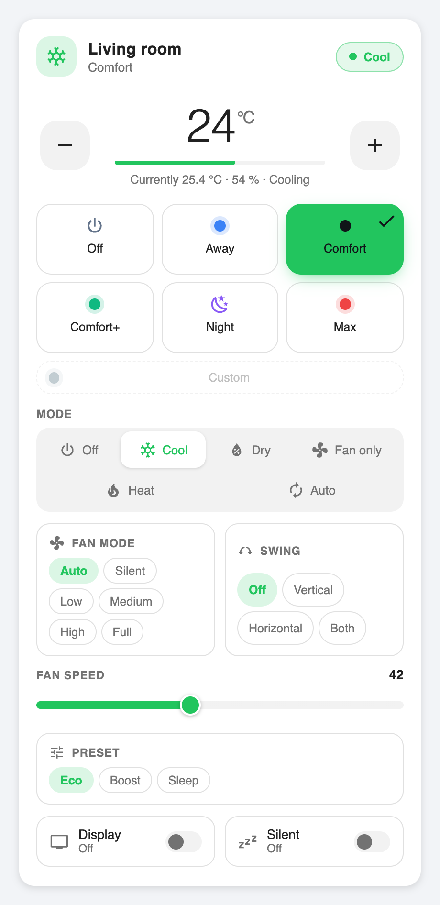 | 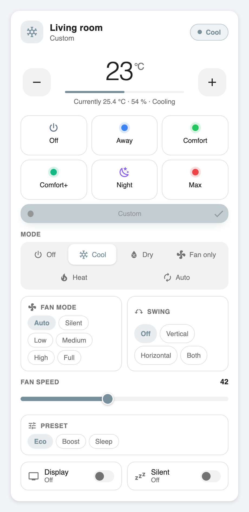 | 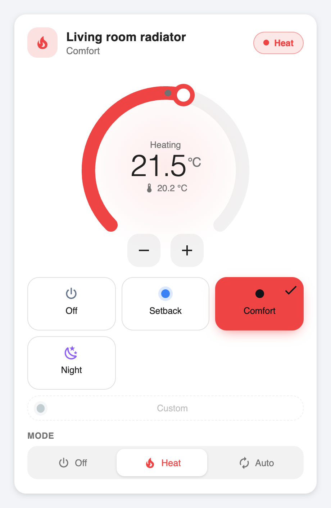 |

| `profile_layout: dropdown` | …with the list open | `profile_layout: icons` |
| --- | --- | --- |
| 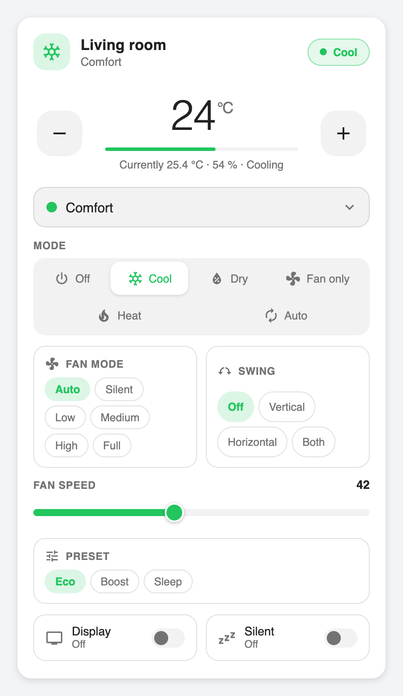 | 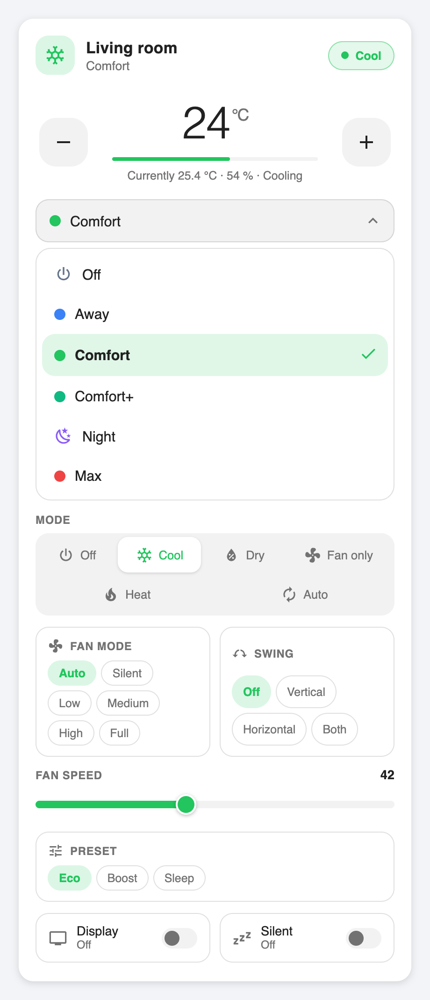 | 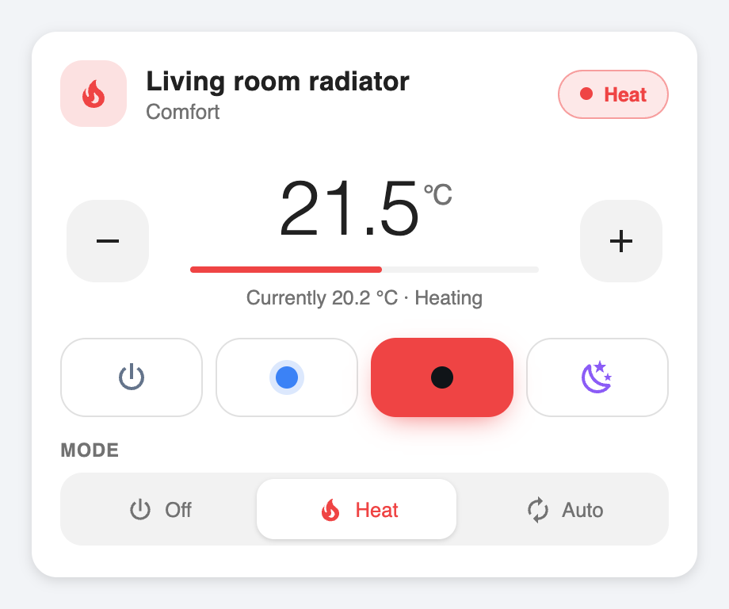 |

The card only renders and calls services. It never decides which profile is
active - that answer always comes from the integration, so the developer
tools, your automations and the card can never disagree.

## Taking manual changes into a profile

Adjust anything while a profile is active and the card offers to keep it:

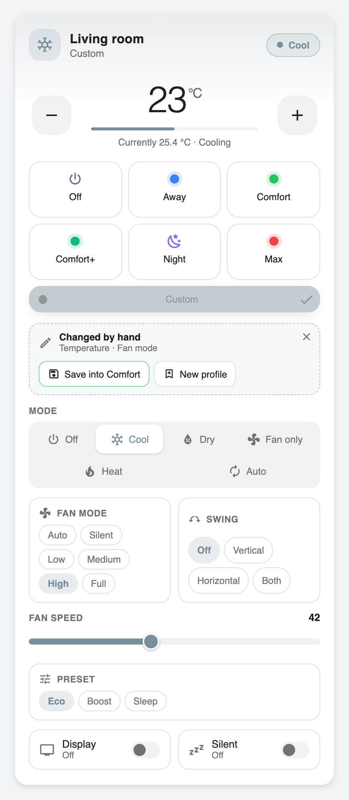

* **Save into <profile>** updates the profile you were in. Values it already
  defines are updated; a value you changed by hand is added to it.
* **New profile** stores the state as a new profile - useful when the
  deviation is worth keeping without bending an existing profile.
* Doing nothing is a third option: the state simply stays custom.

The offer also appears while a *partial* profile is still active. A profile
that says nothing about the fan keeps matching when you change the fan - and
that is exactly a change worth offering to capture.

Nothing is captured automatically unless that profile says so. **Store
automatically** writes the change into the profile a few seconds after the
state goes quiet, wherever it was made - and then the card asks nothing: no
offer appears, not even the "new profile" route, because the question would
answer itself while it stood there.

**Write protection** is set per profile in the options. A protected profile
refuses to be captured into - the card then only offers the "new profile"
route. It can still be edited deliberately in the options; protection guards
the quick path, not the deliberate one.

**The offer can be dismissed** with the × in its corner: the state stays as it
is, it is simply no longer presented as something you just changed. The service
behind it is `climate_profiles.dismiss_change`.

**The offer runs out.** A minute after the last manual change the reference
point is dropped: the card stops offering to capture, and the state is plainly
custom. Every further change starts that minute over, so adjusting something in
several steps does not lose the offer halfway. Capturing into a profile you
name explicitly keeps working.

**After a restart** nothing is assumed. The reference point for "what did you
change" only exists while Home Assistant runs, so a fresh start with a
deviating state stays custom and offers no target until a profile matches
again. Name the profile explicitly in the service call if you need it anyway.

### Chosen or recognised

Each profile says for itself whether it may be **recognised** from the device
state. Switched on, that is what the sections above describe: turn the air
conditioner off with its remote and the card says "Off" - nobody had to press
anything.

A new profile starts with it **off** - a profile is usually something you
choose, and one that becomes active whenever the state happens to fit it is the
exception, typically "Off". Profiles stored before 2.1 keep it on, so updating
changes nothing about them; switch it off by hand where you want that. A
profile saved from the card with **New profile** starts off as well, and is
selected right away, since it is the state you are in.

Switched off for a profile, it is active only while it is the one you selected,
through the card, the select entity or `apply_profile`. Two consequences, and
both are the point:

* **Two profiles may hold the same values.** "Comfort" and "Emica" can both be
  21 °C today and differ again tomorrow; the choice tells them apart, which
  nothing in the device state could.
* **Nothing becomes active by accident.** An automation writing 21 °C directly
  to the climate entity no longer makes the card claim that profile.

Mixing the two is the point of settling it per profile: switch recognition off
for your named targets and leave it on for "Off", and the card follows the
remote control for the one case where you want it to.

Which one wins, when both could:

1. A profile you **selected** stays active while its values hold - also one
   that does not want to be recognised, since choosing it is the only way it
   can become active at all.
2. Otherwise the most specific of the profiles that may be **recognised**.
3. Otherwise custom.

The selection survives a restart. It counts only while its values still hold,
so a device that moved in the meantime leaves the card on custom rather than
claiming a profile that stopped applying hours ago.

Storing a change without asking is the profile's other setting, "Changes by
hand". It applies wherever the change was made: this card, another one, a
script, or the thermostat's own buttons. Home Assistant cannot tell a hand on
the device from the device changing a value by itself, so there is one
exception - the moments right after a profile was applied, which is where a
device's overrides happen. A value the device drops much later is stored like
any other change; it stands in the profile and can be corrected there.

Writing waits until the state has been quiet for a moment, so moving a slider
in steps does not store every step.

### When a profile does not take

Two values of one profile can contradict each other on a real device. A silent
mode that sets its own fan speed makes "fan mode full, silent on" impossible:
whichever is written last wins, and the profile can never match afterwards.

The integration cannot know that - it is device knowledge. It can see the
result. After a profile is applied it waits until the device has been quiet for
a moment, then checks whether the profile actually took. If not, the card says
which values the device did not keep:

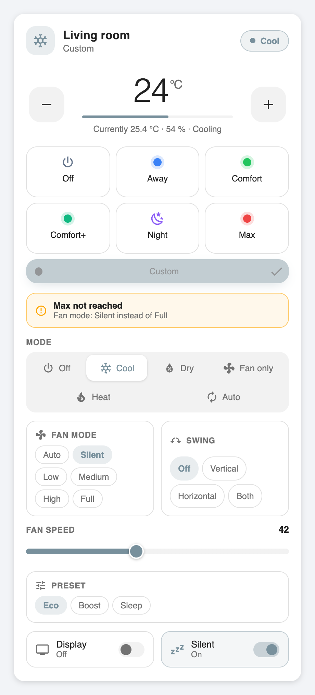

The check does not look once and stop: it keeps watching until the maximum
wait is over, so a device that accepts a value and drops it again a few seconds
later is caught too. Changing something by hand ends the check - from then on
the state is yours, not the device's answer.

It is a report, not an offer: only you know which of the two values was meant.
The same verdict is on the sensor as `unreached`, so an automation can react to
it, and in the log as a warning.

Which value wins is decided by the **order of the values** under Configure. It
is one list over everything - the climate values and your additional ones,
mixed - so a silent mode can go before or after the fan mode. The mode itself
always goes first: most devices ignore everything else while they are off.

### Not only air conditioners

Nothing in the integration assumes cooling. A radiator thermostat with no fan
and no swing modes gets the same profiles, with everything it cannot do left
out - of the card as well:

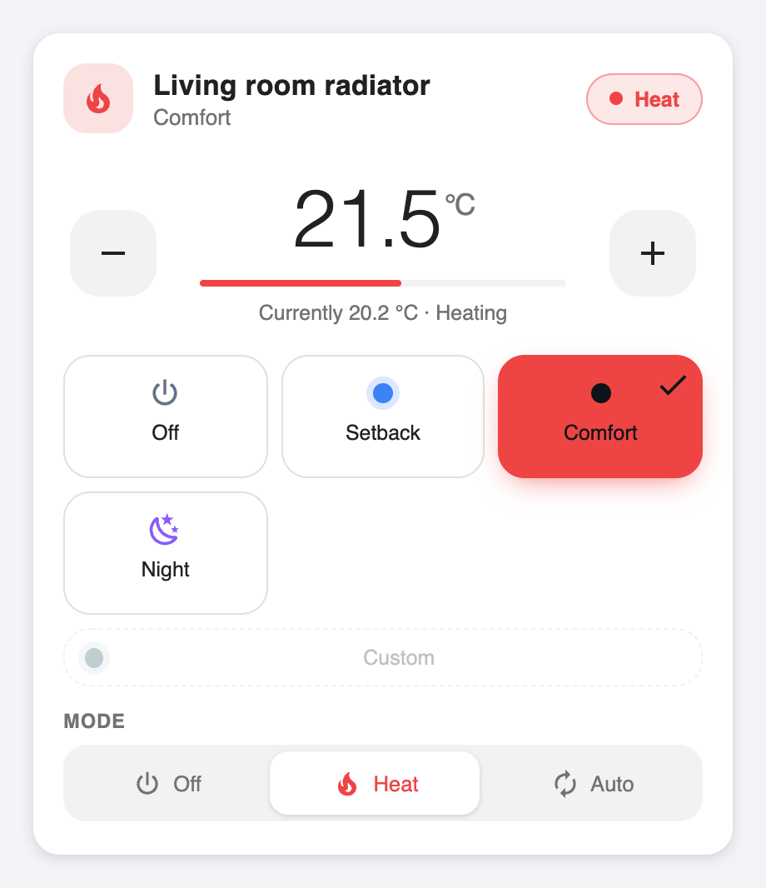

Modes the device does not advertise are never sent, and a value it refuses is
reported rather than silently dropped.

### Known limitations

| Not covered | What happens |
| --- | --- |
| `preset_mode` (eco/comfort/boost on many thermostats) | not a profile value; profiles set the temperature instead of the device's own preset |
| `target_temp_low`/`target_temp_high` (devices in `heat_cool`) | only `temperature` is read and written, so a profile with a temperature never matches such a device - the state stays custom rather than claiming a match |
| `humidity` | not a profile value |

The first two are pinned down by tests in `tests/test_heating.py`. The humidity
a device reports is shown on the card; it is just not something a profile sets.

## Services

### `climate_profiles.apply_profile`

```yaml
action: climate_profiles.apply_profile
target:
  entity_id: sensor.living_room_climate_profile
data:
  profile: Comfort        # name or id
```

Writes only the values the profile defines. Values that already match produce
no service call at all - except when the hvac mode changes, because many
devices reset their attributes on a mode change.

An unknown profile raises a clean `ServiceValidationError` naming the profiles
that do exist; it never destabilises Home Assistant.

### `climate_profiles.set_value`

```yaml
action: climate_profiles.set_value
target:
  entity_id: sensor.living_room_climate_profile
data:
  temperature: 23
  Silent: true          # an additional value, by name or by id
```

Writes individual values and re-evaluates which profile that state
corresponds to. All fields are optional, at least one is required.

Besides the four climate values you can name any of your additional values,
by its name or by its id - ids win, so a value named like another one's id
cannot shadow it. An unknown name is refused with the list of what this device
knows.

### `climate_profiles.capture_profile`

```yaml
action: climate_profiles.capture_profile
target:
  entity_id: sensor.living_room_climate_profile
data:
  profile: Comfort        # optional - defaults to the profile that last matched
  values: [temperature]   # optional - defaults to deciding automatically
```

### `climate_profiles.save_as_profile`

```yaml
action: climate_profiles.save_as_profile
target:
  entity_id: sensor.living_room_climate_profile
data:
  name: Mittagshitze
  color: "#f59e0b"        # optional
  icon: mdi:weather-sunny # optional
  values: [temperature]   # optional - defaults to the whole state
```

### `climate_profiles.dismiss_change`

```yaml
action: climate_profiles.dismiss_change
target:
  entity_id: sensor.living_room_climate_profile
```

Drops the offer to store the current manual change - what the × on the card
calls, and what the offer's own timeout does after a minute. The state itself
is untouched.

More: [`examples/automations.yaml`](examples/automations.yaml).

## Sensor attributes

```yaml
active_profile: Comfort
active_profile_id: 2b3c4d5e…      # stable, use this in automations
active_profile_color: "#22c55e"
profiles: [{id, name, color, icon, order, detect, hidden, capture, protected, values}, …]
custom_profile: {id: __custom__, name: Custom, color: "#78909c", icon: null}
additional_values: [{id, name, entity, icon, order, kind, min, max, step, options}, …]
current_values: {hvac_mode: cool, temperature: 24.0, 7f3a9c1e…: 42, …}
capabilities: {hvac_modes: […], min_temp: 16, target_temp_step: 1, …}
entities: {climate: …, additional: {id: entity_id, …}}
applying: false
last_matched_profile_id: 2b3c4d5e…   # what "capture" would write into
changed_values: [temperature]        # what it would change; empty after a restart
unreached:                           # a profile that was applied but did not take
  {profile_id: …, profile: Max, values: {fan_mode: {wanted: full, actual: silent}}}
```

Automations should trigger on `active_profile_id`. The state is the display
name and changes when you rename a profile; the id does not.

The same holds for the additional values: `current_values` and `changed_values`
carry their ids, and `additional_values` says what each id is called and which
entity is behind it. Renaming a value or pointing it at a different entity
leaves every profile that sets it intact.

## How matching works

A profile matches when **every value it defines** equals the current state.
Values it does not define are ignored:

```text
Profile:  hvac_mode = cool, temperature = 24
Current:  hvac_mode = cool, temperature = 24, fan_mode = high, swing = both
          -> matches
```

Comparison is tolerant where devices are sloppy: case insensitive for modes,
half the device's step width as tolerance for temperatures, and `on`/`off`/
`true`/`false` all mean the same thing. A value that cannot be read (an
unavailable entity) never counts as a match.

When several profiles match at once, **the most specific one is shown** - the
one defining the most values. A profile that only says "heating" is a catch-all
and loses against one that also names the temperature; otherwise picking the
narrower one would look as if nothing had happened. The order decides between
profiles that are equally specific. The options flow writes a line to the log
when a profile is a catch-all for others.

A value whose entity is **unavailable** right now is skipped, not counted as a
mismatch - some devices drop a switch while they are off, and a profile
mentioning it would otherwise be stuck on custom forever. Nothing is written to
such an entity either. A value the device simply stopped reporting does count
as a mismatch, because nothing confirms it.

If no profile matches, the state is the custom profile. It has no values, so
it can never be "applied" - selecting it does nothing on purpose.

## Development

```bash
pip install pytest-homeassistant-custom-component ruff
pytest                 # unit tests + tests against a real Home Assistant
ruff check . && ruff format --check .
python tools/make_screenshots.py     # see docs/screenshots.md
```

The matching logic (`models.py`, `matching.py`) has no Home Assistant imports
at all, which keeps it testable on its own and keeps the rules in one place.

The brand images in `custom_components/climate_profiles/brand/` are rendered
from [assets/climate_profiles_icon.svg](assets/climate_profiles_icon.svg) with
`rsvg-convert` (`brew install librsvg`):

```bash
rsvg-convert -w 256 -h 256 assets/climate_profiles_icon.svg \
  -o custom_components/climate_profiles/brand/icon.png
rsvg-convert -w 512 -h 512 assets/climate_profiles_icon.svg \
  -o custom_components/climate_profiles/brand/icon@2x.png
```

One icon serves both themes on purpose, so there are no `dark_*` variants, and
there is no separate logo either: Home Assistant falls back to the icon
wherever a logo would go. The bundled images are picked up from Home Assistant
2026.3 onwards; older versions show a placeholder on the integrations page.

## Accessibility

Every control is a real button with an `aria-label` and `aria-pressed`, the
focus ring is visible, and the active profile is marked with a check mark and
not by colour alone - except in the icons layout, where the mark would land on
top of the icon; there the filled button and `aria-pressed` carry it. The dial is a `slider` that takes the arrow keys and
reports its value, and its two step buttons do the same job without any
dragging at all. The card measures both candidate text colours against
each profile colour and picks the more readable one. Very saturated mid tone
colours (a strong violet, for example) can still stay slightly below the 4.5:1
AA ratio - the profile name is always shown in the header as plain text as
well.

## Licence

MIT. The vendored Material Design Icons paths in `tools/mdi-paths.js` are
Apache-2.0.
